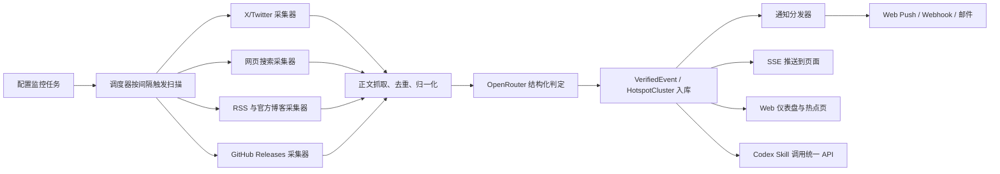

# Hot Monitor 实施文档

## 目标
- 第一时间发现与 AI 领域相关的关键词命中和范围热点。
- 通过多信息源采集 + AI 结构化识别，降低假冒、转载和标题党带来的误报。
- 先交付响应式 Web 产品，再将同一能力封装成可复用的 Codex Skill。

## 技术栈
- 前端：React 19、Vite 7、TypeScript、React Router 7、Tailwind CSS 4、vite-plugin-pwa
- 后端：Fastify 5、TypeScript、SQLite、Drizzle ORM、@libsql/client
- AI：OpenRouter Chat Completions + JSON Schema structured outputs
- 通知：Web Push、Webhook、SMTP 邮件
- 测试：Vitest、Playwright

## 核心模型
- `Monitor`：监控任务，分 `keyword` 与 `topic` 两种模式。
- `SourceItem`：多源采集的标准化原始内容。
- `VerifiedEvent`：经过 AI 判定后可通知的真实事件。
- `HotspotCluster`：多源聚类后的热点主题。

## 数据流

## 里程碑
1. 建立 workspace、环境变量、数据库与基础页面骨架。
2. 实现监控 API、调度器和多源采集。
3. 接入 OpenRouter 进行结构化真假识别与热点聚类。
4. 完成 Web Push、Webhook、邮件通知以及 SSE 实时流。
5. 完成 Web 验收后封装 `skills/hot-monitor`。

## 验收清单
- 可创建、编辑、启停监控任务。
- 可手动触发和定时触发扫描。
- 关键词监控能过滤误报并生成通知摘要。
- 范围热点页能展示聚类后的多源热点。
- 三类通知均可测试发送与真实触发。
- Skill 可创建监控并读取热点结果。
