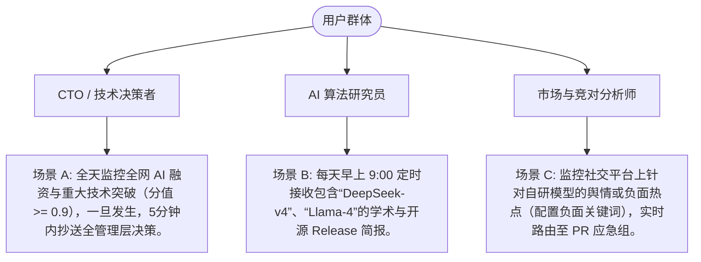

# 智能订阅分流引擎与高拟物感通知邮件设计 PRD

## 1. 文档基本信息

| 字段 | 内容 |
| :--- | :--- |
| **项目名称** | Hot-Monitor (AI 领域热点监控服务) |
| **功能模块** | 智能通知设置 & 拟物化邮件系统重构 |
| **文档版本** | V1.0.0 (基线版) |
| **作者** | 高级产品经理 |
| **创建日期** | 2026-05-24 |
| **文档状态** | 评审中 |

---

## 2. 背景与业务目标

### 2.1 背景痛点
目前 Hot-Monitor 具备了强大的 AI 聚类判别和多源数据抓取能力，但在信息分发端（通知通道）仍处于相对粗放的阶段：
1. **通道硬编码限制**：缺乏灵活的分发通路，无法满足针对不同主题、不同关键词将情报路由至不同利益相关者（如技术、市场、PR）的诉求。
2. **缺乏防轰炸机制**：热点事件在演进过程中，持续被不同的信源报道，如果每次微小更新都发送通知，会导致用户邮箱充斥着垃圾邮件。
3. **信息呈现简陋**：现有的通知格式信息密度低、视觉疲劳感重，未能继承 Hot-Monitor 前端引以为傲的“Apple 级毛玻璃高感”美学，无法在邮件客户端中给用户带来视觉冲击与权威感。

### 2.2 业务目标
*   **多维度灵活路由**：通过构建“矩阵式规则配置器”，实现“关键词 $\rightarrow$ 目标接收组”的按需订阅与动态路由。
*   **分级频次控制**：支持“实时警报”与“定时简报”双轨调度，既满足紧急情报的低延迟送达，又解决日常情报的降噪聚合。
*   **视觉与信息密度双优**：重构响应式 HTML 邮件模板，在各大主流邮件客户端（如 Outlook、Gmail、Apple Mail）中高度还原拟物化卡片排版，实现情报价值的瞬间跃升。

---

## 3. 用户画像与核心场景



---

## 4. 功能架构设计

重构后的“通知设置”由以下四大核心业务模块构成，完全基于业务逻辑与用户模型，不涉及底层数据库或后端具体实现：

```
通知设置与分发系统
├── 1. 订阅规则管理 (Rule Engine)
│   ├── 规则元数据 (名称、状态开关)
│   ├── 精细化过滤矩阵 (任务源、关键词逻辑、热度阈值、信源白名单)
│   └── 路由接收组配置 (一对多邮箱映射)
├── 2. 定时与实时调度策略 (Scheduler Controller)
│   ├── 实时秒级警报 (支持独立冷却期，避免重复通知)
│   ├── 定时周期汇总 (自定义多时点、日/周频次选择)
│   └── 静默期与免打扰 (夜间静默自动归档至次日早报)
├── 3. 反馈闭环与防轰炸机制 (Feedback Loop)
│   ├── 热点演进智能去重 (只对变化度 > 30% 的演进事件发次级通知)
│   └── 邮件一键负反馈 (收件箱一键标记“不相关”以自动微调打分参数)
└── 4. 拟物化邮件格式 (Apple Glassmorphism Email Styles)
    ├── 实时预警邮件模板 (红呼吸灯、单卡深度拆解、高可信背书)
    └── 周期汇总简报模板 (灰白高雅卡片流、热度排行榜、变化趋势线)
```

---

## 5. 订阅规则配置详案

重新设计的“通知设置”面板应当是一个优雅、无框、具有 Apple 毛玻璃高亮悬浮感的独立 Tab 页面。

### 5.1 订阅规则模型（矩阵式配置）
用户可以通过配置“订阅规则”（Subscription Rules）来自由定义情报路由：

| 配置维度 | 功能描述 | 用户操作与交互设计 |
| :--- | :--- | :--- |
| **基本信息** | 定义该条订阅规则的业务属性。 | • 输入规则名称（如“DeepSeek 动态预警”）<br>• 启用/禁用拨动开关 |
| **信息筛选矩阵**<br>*(Filters)* | 支持通过“多维度相交逻辑”过滤出精准热点。 | **1. 监控源绑定**：支持选择“全部任务”或勾选特定监控任务（Monitor Tasks）。<br>**2. 关键词表达式**：支持三段式输入：<br>  - 包含任意关键词（OR关系，英文逗号分隔）<br>  - 必须同时包含（AND关系）<br>  - 排除关键词（NOT关系，过滤噪音）<br>**3. 综合热点评分闸值**：滑动拉杆选择（Score $\ge$ 0.0 - 1.0），默认只通知高热点（$\ge 0.7$）。<br>**4. 覆盖规模/信源质量过滤**：支持勾选“仅通知官方信源（可信度 $\ge 0.9$）”或“底层信源数 $\ge N$”。 |
| **发送频次策略**<br>*(Trigger)* | 定义该订阅规则的投递时间特征。 | **1. 实时（Instant Alert）**：热点一旦生成即刻推送。<br>**2. 定时（Scheduled Digest）**：支持选择日/周频次，并精确到分钟（如“每日 09:00”、“每周五 17:30”）。可添加多个发送时点。 |
| **路由接收人**<br>*(Recipients)* | 设定接收该过滤结果的目标利益体。 | • 输入多个邮箱地址（自动补全、支持邮箱组/邮件列表标签，如 `cto-office@company.com`）。 |

### 5.2 订阅配置的“与/或”交叉路由示例
*   **路由规则 1**：【监控主题 = "开源LLM"】 AND 【关键词 = "DeepSeek-v4", "Llama-4"】 AND 【热度分数 $\ge 0.85$】 $\rightarrow$ **实时发送** $\rightarrow$ `tech-core@company.com`（技术攻关组）
*   **路由规则 2**：【监控主题 = "AI投融资"】 OR 【关键词 = "估值", "首轮", "OpenAI融资"】 AND 【热度分数 $\ge 0.65$】 $\rightarrow$ **每日早上 09:00 发送** $\rightarrow$ `investment@company.com`（投资分析组）
*   **路由规则 3**：【监控主题 = "全网热点"】 AND 【热度分数 $\ge 0.95$（世纪爆料）】 $\rightarrow$ **实时发送（闪电通道）** $\rightarrow$ `all-hands@company.com`, `pr-team@company.com`（全员及公关组）

---

## 6. 发送调度与防打扰机制

### 6.1 实时推送下的“防轰炸冷却机制 (Notification Cooldown)”
为了防止在热点事件发酵初期，由于各路自媒体频繁报道导致系统在短时间内向用户邮箱连发数十封邮件，引入以下策略：
*   **首发警报**：当某热点簇（Hotspot Cluster）首次满足订阅阈值时，触发第 1 封警报邮件。
*   **冷却锁定**：发送后，该热点簇针对该订阅规则进入为期 **4 小时**的“冷却锁定期”。在锁定期间，即使该热点有新的关联事件加入或分数发生小幅波动，也不再触发独立邮件。
*   **演进追加（重大变更触发）**：只有当发生以下“质变”时，才会冲破冷却锁定期，发送追加通报：
    *   热点簇的综合得分（Score）上升超过 **0.15**；
    *   新增了**官方机构（可信度分 $\ge 0.95$）**的正式公告背书。

### 6.2 周期简报下的“数据静默归档机制 (Silent Period)”
*   **静默时间段**：支持用户设置“防打扰时间段”（例如每日 22:00 至次日 08:00）。
*   **归档延期**：在此时间段内，若有满足“实时推送”条件的情报，系统应不予立即投递，而是暂时归入“静默缓存池”。
*   **唤醒投递**：在静默期结束的瞬间（如 08:00），系统自动将静默期内积压的所有预警进行一次性聚合并生成“夜间热点汇总简报”投递出去。
*   *特殊例外*：用户可配置“强穿透白名单”（如：综合热度达到 0.98 以上的极其罕见级超高热点，不受静默期限制，必须强行推送）。

---

## 7. 拟物化邮件格式设计（核心视觉方案）

> [!NOTE]
> 邮件排版深度借鉴 Apple 系统设计规范。为了解决各主流邮件客户端对 CSS3 backdrop-blur（高斯模糊）支持不一的硬伤，本方案在 HTML 邮件设计中采用“降级美学设计”：使用**高透明度、精细圆角、超细微发光边框线**（`border: 1px solid rgba(255,255,255,0.4)`）来模拟拟物感毛玻璃效果。页面底色建议使用柔和极浅灰背景，卡片使用雪白卡片，突出空气流动感。

### 7.1 【实时预警邮件 (Instant Alert Email)】
*   **设计基调**：尊贵、警示、高信息密度。
*   **适用场景**：单条爆发性高热点通知。

#### 7.1.1 实时预警邮件 HTML 排版规范草图

```
+-----------------------------------------------------------------------------------+
|  [ HOT MONITOR ]  • 实时情报通报                                                   |
+-----------------------------------------------------------------------------------+
|  (🔴 EVENT BREATHING INDICATOR) 发现重大 AI 领域高热事件                           |
|  本通知基于订阅规则：[ 核心竞争对手监控-高热级 ]                                      |
+-----------------------------------------------------------------------------------+
|                                                                                   |
|  +-----------------------------------------------------------------------------+  |
|  |  [信源渠道] 官方博客 / GitHub Releases (可信度分 0.96)                         |  |
|  |  -------------------------------------------------------------------------  |  |
|  |                                                                             |  |
|  |  DeepSeek-v4 架构白皮书与权重正式开源：首创启发式动态协同 MoE 路由架构            |  |
|  |                                                                             |  |
|  |  +---------------------------+ +---------------------------+ +------------+  |  |
|  |  | 新鲜度: ⏰ 100% (5M ago)  | | 互动热度: 🔥 92% (12K+)   | | 覆盖: 6源  |  |  |
|  |  +---------------------------+ +---------------------------+ +------------+  |  |
|  |                                                                             |  |
|  |  [情报摘要]                                                                 |  |
|  |  DeepSeek 刚刚发布了其最新一代大语言模型 DeepSeek-v4 的技术白皮书并开源了全部权  |  |
|  |  重。该模型首创了“启发式动态协同 MoE”架构，在多模态理解与逻辑推理上比肩 GPT-4o，|  |
|  |  而其训练与推理成本骤降 75%，预计将对整个开源大模型生态产生颠覆性冲击。         |  |
|  |                                                                             |  |
|  |  -------------------------------------------------------------------------  |  |
|  |  [信源追踪与原著链路]                                                        |  |
|  |  🔗 官方博客公告 - openai.com/news/deepseek... [信任分 0.95]                 |  |
|  |  🔗 GitHub 代码仓 - github.com/deepseek-ai/...   [信任分 0.92]                 |  |
|  |  🔗 Hacker News 热烈讨论帖 (420 Points)           [信任分 0.88]                 |  |
|  +-----------------------------------------------------------------------------+  |
|                                                                                   |
+-----------------------------------------------------------------------------------+
|  [ 反馈闭环与控制台 ]                                                              |
|  👍 这条情报对我很重要  •  👎 内容不相关，减少此类推荐  •  ⚙ 调整过滤阈值             |
+-----------------------------------------------------------------------------------+
|  退订本规则 • 查看控制台 • Hot-Monitor © 2026                                      |
+-----------------------------------------------------------------------------------+
```

---

### 7.2 【周期汇总简报 (Periodic Digest Email)】
*   **设计基调**：高雅、结构化、全局感。
*   **适用场景**：每日早间情报日报（Daily Report）或每周总结。

#### 7.2.1 周期汇总简报 HTML 排版规范草图

```
+-----------------------------------------------------------------------------------+
|  [ HOT MONITOR ]  • 情报每日简报                                                   |
+-----------------------------------------------------------------------------------+
|  📅 日报区间：2026年05月23日 09:00 - 2026年05月24日 09:00                           |
|  📊 订阅规则：[ AI 投融资与前沿研究每日早报 ]                                         |
+-----------------------------------------------------------------------------------+
|                                                                                   |
|  [ 📈 本期简报数据洞察 ]                                                           |
|  本期共扫描 1,240 个信源，聚合生成高热点簇 4 个，中度候选热点 8 个。                  |
|                                                                                   |
|  ==================== 💡 本期高热度排行榜 (TOP 3) ====================              |
|                                                                                   |
|  #1  [Score 98%]  DeepSeek-v4 架构白皮书正式开源，成本骤降 75%                       |
|  #2  [Score 89%]  Anthropic 宣布完成新一轮 65 亿美元融资，估值达 400 亿              |
|  #3  [Score 85%]  Hugging Face 推出新一代轻量级推理引擎，支持本地 WebGPU 并行       |
|                                                                                   |
|  ==================== 📂 监控主题卡片流 (以主题分组) ====================            |
|                                                                                   |
|  [ 主题：前沿大模型与开源生态 ]                                                      |
|  +-----------------------------------------------------------------------------+  |
|  |  #1. DeepSeek-v4 架构白皮书正式开源，成本骤降 75%                               |  |
|  |  ⏰ 新鲜: 95%  •  🔥 互动: 98%  •  🌐 覆盖: 12 渠道                             |  |
|  |  [摘要] 该模型首创“启发式动态协同 MoE”架构，在多模态与逻辑推理上比肩 GPT-4o。   |  |
|  |  🔗 访问原著 (共 4 个信源)                                                    |  |
|  +-----------------------------------------------------------------------------+  |
|                                                                                   |
|  [ 主题：行业投融资与独角兽动态 ]                                                    |
|  +-----------------------------------------------------------------------------+  |
|  |  #2. Anthropic 宣布完成新一轮 65 亿美元融资，估值达 400 亿                     |  |
|  |  ⏰ 新鲜: 64%  •  🔥 互动: 82%  •  🌐 覆盖: 5 渠道                              |  |
|  |  [摘要] 本轮融资由阿里领投，将全力加速下一代 Claude 5 模型的研发与算力集群建设。 |  |
|  |  🔗 访问原著 (共 2 个信源)                                                    |  |
|  +-----------------------------------------------------------------------------+  |
|                                                                                   |
+-----------------------------------------------------------------------------------+
|  [ ⚙ 订阅控制中心 ]                                                                |
|  本简报由 Hot-Monitor 自动调度发送。您可以随时：                                     |
|  • 调整发送时间 (目前为 每天 09:00)  • 增删订阅关键词  • 一键退订此日报             |
+-----------------------------------------------------------------------------------+
|  Hot-Monitor 情报分发系统  |  联系支持  |  隐私声明  |  © 2026                         |
+-----------------------------------------------------------------------------------+
```

---

## 8. 高级体验与拓展功能设计

为使此方案在企业级落地中达到顶尖水准，设计以下三项拓展功能，以完善功能闭环：

### 8.1 订阅链路可信追溯 (Trust Anchor Traceback)
*   **痛点**：用户收到邮件后，往往会对 AI 总结出来的“摘要”产生可信度质疑。
*   **解决方案**：在卡片中的“信源追踪与原著链路”处，每个链接均由系统自动附加**【信源类型标签】**（如：`[官方机构]`、`[独立黑客]`、`[海外高分社区]`）和**【域名原始信任分】**（如 `0.95`）。这不仅提供了透明的背书，还方便用户瞬间甄别是“官方实锤”还是“社交八卦”。

### 8.2 闭环式智能负反馈机制 (Feedback Loop)
*   **功能逻辑**：邮件底部提供 `👍 这条情报对我很重要` 和 `👎 内容不相关` 按钮。
*   **业务作用**：
    *   用户点击后，无需登录系统，在邮件中直接触发反馈动作，系统弹出一个高拟物感毛玻璃极简确认页（支持一键反馈“分类错误”、“分数过高”或“不是我关注的细分关键词”）。
    *   此反馈将作为系统热点评分参数微调的输入，逐步实现个人/企业私有化的“AI 情报精准度演进”。

### 8.3 订阅健康看板与送达监控 (Health Dashboard)
*   **功能逻辑**：在系统后台的“通知设置”主页，提供一个轻量化的订阅投递状态看板。
*   **核心指标**：
    *   **送达成功率（Delivery Success Rate）**：展示 SMTP 的送达状态，若因目标邮箱满员或被判定为垃圾邮件而退信，系统应在控制台主页以**淡橘色渐变条**进行显式提醒。
    *   **噪音比（Noise Ratio）**：展示触发的邮件中被用户标记为“不相关”的比例，帮助系统管理员及时收紧规则里的过滤拉杆。

---

## 9. 容错与降级策略

### 9.1 AI 服务调用失败时的邮件生成降级
*   **触发场景**：在大模型服务不可用（如限流、API 密钥失效）时，热点降级为 Heuristic 启发式打分聚类。
*   **邮件格式降级方案**：
    1.  **文案降级**：邮件顶部的“AI 情报摘要”替换为“**[Heuristic 模式降级生成]** 因 AI 服务临时繁忙，本条摘要由系统根据最高可信度信源段落进行启发式提取，请酌情参考。”
    2.  **指标降级**：热度打分公式自动切换为 `(最高信任分 × 0.45) + (最高互动分 × 0.25) + (最新新鲜分 × 0.3)`，并在卡片评分胶囊条前展示一个**黄色预警状态图标**，以确保数据真实性。

### 9.2 定时发送时的数据枯竭降级
*   **触发场景**：在设置的定时发送时刻（如每天早上九点），数据库中满足过滤规则的新增热点簇数量为 0。
*   **降级策略**：
    *   不发送完全空白的简报邮件（这属于无效骚扰）。
    *   系统自动发送一封**高拟物感极简静默报信邮件**，标题为：“[Hot-Monitor] 昨日警报：未发现满足过滤条件的重大 AI 动态”，正文提示：“监控系统在过去 24 小时运行平稳，未发生高于指定阈值（Score $\ge$ 0.70）的情报，我们将继续为您密切监控。”以告知用户系统依然在正常工作。
